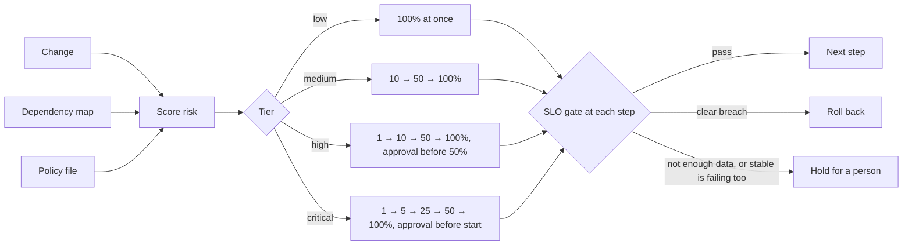

# Deploy Risk Gate

Not every change deserves the same rollout. A typo fix in the docs and a
refactor of payment authorisation should not go to production the same way.

This tool does three things:

1. **Scores the risk** of a change from 0 to 100, with every point attributed
   to a named factor.
2. **Picks a rollout plan** to match: straight to 100% for low risk, small
   canary steps with human approval for high risk.
3. **Gates each step on SLOs**, comparing the new version with the stable one
   running beside it, and rolls back on a clear breach.

All three are decided by code and a policy file. A model can optionally
explain the score to the reviewer; it cannot change it.



## Try it

Nothing below needs a cluster, a network or an API key.

```bash
pip install -e ".[dev]"

deploy-gate assess --change samples/changes/04-auth-refactor.json --services samples/services.json
deploy-gate plan   --change samples/changes/04-auth-refactor.json --services samples/services.json --argo
deploy-gate apply-plan --change samples/changes/04-auth-refactor.json --services samples/services.json \
                       --rollout samples/k8s/rollout.yaml
deploy-gate calibrate --history samples/history.jsonl
deploy-gate simulate fault-only-under-load
deploy-gate eval
python -m pytest -q
```

In CI, score the pull request itself from its git diff:

```bash
deploy-gate assess --base origin/main --service checkout-api \
  --depmap-url http://depmap.internal:8080 --fail-on critical
```

`--depmap-url` reads the blast radius from the
[Istio dependency mapper](https://github.com/himohann-cpu/istio-dependency-mapper)
API; `--services` reads the same information from a file.

## How risk is scored

| Factor | Points | What it looks at |
|---|---|---|
| `change_kind` | 0 to 25 | The riskiest kind of file touched: migration 25, infrastructure 18, config 15, dependency 12, code 5, docs 0 |
| `size` | 0 to 22 | Lines changed |
| `many_files` | 5 | More than 15 files |
| `sensitive_paths` | 15 | Paths containing auth, payment, billing, crypto, secrets or permission |
| `no_tests` | 10 | Code or schema changed with no test file in the change |
| `blast_radius` | 0 to 15 | How many services depend on this one, within three hops. A service missing from the map scores 5 as unknown, not 0. |
| `recent_incidents` | 0 to 10 | Incidents on the service in the last 30 days |
| `timing` | 8 | Deploying outside working hours, at a weekend, or late on a Friday |

Scores map to tiers: below 25 low, below 50 medium, below 75 high, otherwise
critical. A change freeze blocks the deploy whatever the score.

Two rules sit outside the score:

- **Docs-only and test-only changes score 0.**
- **A migration always needs approval before the rollout starts.** Shifting
  traffic back does not undo a schema change, so automatic rollback is not a
  safety net for it.

Every number above lives in `src/deploy_gate/default_policy.json`. Override
any of it with `--policy your-policy.json`; repeat `--policy` to layer files,
for example your own overrides and then the learned weights.

## Weights that learn from outcomes

The points above are a starting position. The tool adjusts them from what
actually happens to your rollouts, in two ways.

**Straight away, per service.** When a rollout is rolled back or a change is
tied to an incident, the next changes to that service score higher for 30
days through the `recent_incidents` factor. Nothing needs recalculating.

**Over time, per factor.** `calibrate` compares how often changes carrying
each factor failed with how often changes fail overall. Factors that fail
more than average gain weight; factors that fail less lose it.

```bash
# Record what happened (deploy-gate run --execute --history does this itself)
deploy-gate record --change change.json --history deploy-history.jsonl --outcome rolled_back
deploy-gate record --change change.json --history deploy-history.jsonl --outcome incident   # found later

deploy-gate calibrate --history deploy-history.jsonl                       # show what would change
deploy-gate calibrate --history deploy-history.jsonl --write learned.json  # save the adjusted weights
deploy-gate --policy learned.json assess --history deploy-history.jsonl ...
```

On the sample history (40 rollouts, 6 failures):

| Factor | Rollouts | Failures | Failure rate | Lift over average | Weight before | Weight after |
|---|---|---|---|---|---|---|
| `change_kind:config` | 8 | 3 | 38% | 1.67x | x1 | x1.1 ▲ |
| `no_tests` | 10 | 3 | 30% | 1.50x | x1 | x1.1 ▲ |
| `change_kind:migration` | 6 | 2 | 33% | 1.46x | x1 | x1.1 ▲ |
| `change_kind:code` | 16 | 1 | 6% | 0.64x | x1 | x0.9 ▼ |
| `change_kind:dependency` | 6 | 0 | 0% | 0.62x | x1 | x0.9 ▼ |

(Four more factors moved up one step; the full table prints when you run it.)
A learned weight shows in every assessment: `includes a config change (weight
x1.1, learned from past rollouts)`.

The adjustment is cautious on purpose:

| Guard | Default | Why |
|---|---|---|
| Smoothing toward the overall failure rate | as if 10 extra rollouts at the average rate | One bad rollout on a rarely seen factor cannot swing it |
| Maximum move per calibration | 10% | A bad week does not rewrite the policy |
| Bounds | 0.5x to 2x | No factor can be learned away to nothing, or come to dominate |
| Deadband | 5% | Weights already close to the evidence are left alone |
| Minimum history | 10 finished rollouts, with at least one failure and one success | Nothing is learned from too little |
| Held rollouts | Not counted | They are neither a success nor a failure |

The same history always gives the same weights, and no model is involved.

`calibrate` also reports whether the score is worth trusting: the failure
rate in each tier, and how often a failed change had scored higher than a
successful one. If that figure sits near 50%, the score is not predicting
anything and the factors need rethinking, not just reweighting.

To adjust automatically, add `--learn learned.json` to `record` or `run`. It
recalibrates only after every 10 newly finished rollouts, so the 10% limit is
not applied over and over on the same evidence. To keep a person in the loop
instead, run `calibrate --write` on a schedule and review the change to
`learned.json` like any other pull request.

## How the gate decides

At each check the gate compares the canary with the stable version over the
same window.

| Verdict | Condition | Effect |
|---|---|---|
| `pass` | Within the SLO | Promote when the bake time is up |
| `breach` | Over the SLO, clearly worse than stable, and too large a gap to be chance | Roll back |
| `insufficient_data` | Fewer than 200 canary requests in the window | Wait. Never promote on no data. |
| `baseline_unhealthy` | Stable is over the SLO too | Wait. Rolling back the canary would fix nothing. |
| `inconclusive` | Over the SLO, but not clearly worse than stable | Wait |

"Wait" extends the bake up to twice. If the gate still cannot pass, the
rollout holds at its current weight for a person to decide.

"Too large a gap to be chance" is a two-proportion z-test at roughly 99%
confidence. Latency uses p99 against the SLO and against 1.3 times stable.

## Results on simulated rollouts

`deploy-gate eval` runs eight simulated rollouts whose right outcome is known.

| Scenario | Plan | Outcome | Peak traffic on new version | Harmed requests | Same release sent straight to 100% |
|---|---|---|---|---|---|
| Healthy release | medium | completed | 100% | - | - |
| Error regression (8% errors) | medium | rolled back | 10% | 47 | 468 |
| Latency regression | medium | rolled back | 10% | 600 | 6,000 |
| Small regression, critical tier | critical | rolled back | 1% | 7 | 168 |
| Fault that appears only under load | high | rolled back | 50% | 144 | 288 |
| Dependency outage hitting both versions | medium | held | 10% | - | - |
| Too little traffic to judge | high | held | 1% | - | - |
| Slightly noisy but healthy | medium | completed | 100% | - | - |

All four bad releases were stopped, none reached 100%, and no healthy release
was rolled back. Across the bad releases, 798 requests were harmed with staged
rollouts against 6,924 when the same release went straight to 100% behind the
same gate.

Read these as a demonstration, not a benchmark. I wrote the scenarios and the
gate, the traffic is simulated at a steady 100 requests per second, and the
counts are expected values with no randomness. The eval exists so that a
change to the policy that starts rolling back healthy releases, or letting bad
ones through, fails CI.

## Using it with an existing Argo Rollout

If a service already has an Argo canary defined, it has one fixed set of steps
for every change. `apply-plan` rewrites just those steps to match the risk of
the change being deployed, and leaves the rest of the manifest alone.

```bash
# In CI, before the manifest is applied:
deploy-gate apply-plan --base origin/main --service checkout-api \
  --services services.json --rollout k8s/rollout.yaml            # prints a diff
deploy-gate apply-plan ... --rollout k8s/rollout.yaml --write    # rewrites the file
```

For the sample manifest and a high-risk change, the diff is:

```diff
       steps:
-        - setWeight: 20
-        - pause: {duration: 5m}
-        - analysis:
+        - setWeight: 1
+        - pause: {duration: 10m}
+        - analysis:
             templates:
               - templateName: smoke-test
-        - setWeight: 60
-        - pause: {duration: 5m}
+        - setWeight: 10
+        - pause: {duration: 15m}
+        - analysis: ...
+        - pause: {}
+        - setWeight: 50
+        ...
```

What it changes and what it keeps:

| In the manifest | What happens |
|---|---|
| `setWeight` and `pause` steps | Replaced by the plan's weights and bake times |
| Other steps: `analysis`, `experiment`, `setCanaryScale`, header and mirror routes | Kept. Those before the first `setWeight` stay first; the rest run after the bake of every stage, so there are never fewer checks than before. |
| Background `analysis`, traffic routing, pod template, other documents | Untouched |
| Approval required by the plan | Added as an indefinite `pause: {}` that a person promotes |
| Rollout metadata | Gains `deploy-gate.dev/tier`, `score` and `change` annotations |

It shows a diff unless you pass `--write`, refuses blue-green Rollouts, and
leaves the file alone during a change freeze. Running it twice gives the same
result. `--github-output` writes `tier`, `score` and `blocked` for later
pipeline steps. One loss to know about: comments inside the `steps` list are
not carried over; comments elsewhere are.

`apply-plan` needs `pip install "deploy-gate[argo]"`.

### Who decides promotion

| Mode | Steps written | Who promotes and rolls back |
|---|---|---|
| Default | Timed pauses | Argo, using your AnalysisTemplates |
| `--gated` | Indefinite pauses | `deploy-gate run`, using this tool's gate |

Use the default if your analysis templates already do what you want. Use
`--gated` if you want this tool's gate, including "hold when the stable
version is failing too", which Argo analysis does not do unless you write a
template that compares canary with stable.

## Setting traffic weights

`deploy-gate run` walks a live rollout through the plan: set a weight, check
the gate each minute against Prometheus, then promote, hold or roll back.

```bash
deploy-gate run --change change.json --services services.json \
  --deployer argo --name checkout-api --namespace shop \
  --prometheus http://prometheus.istio-system:9090 \
  --canary-revision v2 --stable-revision v1            # add --execute to act
```

| Deployer | For | How it sets the weight |
|---|---|---|
| `argo` | A Rollout prepared with `apply-plan --gated` | `kubectl argo rollouts promote` to move to the next stage, `abort` to roll back. It waits until Argo reports the new weight before judging the canary. |
| `istio` | A VirtualService with a stable and a canary route, no Argo | `kubectl patch virtualservice` with the two route weights; weight 0 to roll back |

**Without `--execute` nothing changes.** The commands are printed and the
gate still reads real metrics, so you can watch what it would have done on a
real rollout before trusting it to act. Steps that need a person stop the run
unless you pass `--approve`.

If Prometheus becomes unreachable mid-rollout, or the platform does not reach
the requested weight, the run holds at the current weight. It does not
promote or roll back without evidence.

## Optional model explanation

Set `DEPLOY_GATE_PROVIDER` (`gemini` or `claude`), `DEPLOY_GATE_MODEL` and the
provider's API key. The model receives the scored factors and writes a short
summary and a list of things for the reviewer to look at.

Its reply is checked. It is dropped if it refers to a factor that was not
scored, names a different tier, or states a different score. Commit titles
and file paths reach it inside a block marked as untrusted data.

## Layout

```
src/deploy_gate/
  risk.py             scores a change
  change.py           reads a change from JSON or a git diff; classifies files
  blast.py            how many services depend on this one
  policy.py           loads the policy file
  default_policy.json every threshold, tier and rollout plan
  rollout.py          builds the plan; the controller loop
  gate.py             the SLO gate
  prommetrics.py      canary and stable metrics from Prometheus (Istio)
  argo.py             fits a plan into an existing Argo Rollout manifest
  deployers.py        sets traffic weights through Argo Rollouts or an Istio VirtualService
  simulate.py         simulated service for the eval
  evals.py            scenarios and scoring
  history.py          append-only record of rollout outcomes
  calibrate.py        adjusts the risk weights from that record
  llm.py              optional explanation, and the checks on it
samples/              six changes, a service map, an example Rollout and a rollout history
ci/ci.yml             CI workflow; move it to .github/workflows/
DESIGN.md             the reasoning behind the decisions
```

## Status and limits

- **Not yet run against a real cluster.** The deployers are tested by checking
  the exact kubectl commands they issue, and `apply-plan` against a sample
  manifest. Neither has driven a real rollout. Start with `run` without
  `--execute`.
- **The Prometheus reader is tested against a local stand-in**, not a real mesh.
- **Kept steps are repeated after every stage.** If your analysis steps were
  meant for one specific stage only, review the diff.
- **Background analysis `startingStep` is not adjusted** when the number of
  steps changes.
- **Model clients are untested against live models.**
- **Starting weights are hand-set.** They adjust from your rollout history,
  but the sample history shipped here is made up to show the mechanism.
- **Learning sees correlation, not cause.** Factors that tend to appear
  together share credit and blame, and a factor that only ever appears on
  risky services will look risky itself.
- **Learning needs failures to be recorded.** An incident traced to a change
  days later has to be recorded with `--outcome incident`, or the change
  counts as a success.
- **The significance test is approximate** and weakest at very low error
  counts, which is one reason the gate refuses to judge under 200 requests.
- **Schema changes cannot be canaried by traffic weight.** The tool flags
  them and requires approval; it does not make them safe.
- **Deploy hours use a fixed UTC offset**, so they do not follow daylight
  saving changes.
